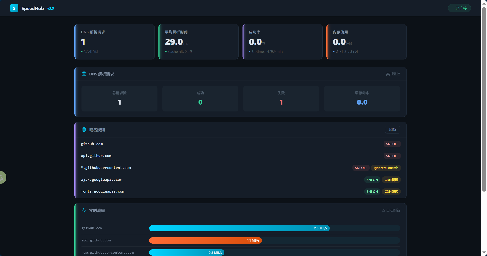

# ⚡ SpeedHub

<p align="center">
  <strong>新一代开发者网络加速器</strong><br>
  <em>Accelerate Your Code</em>
</p>

<p align="center">
  
  
  
</p>

---

## ✨ 特性

| 功能 | 描述 |
|------|------|
| 🌐 **多协议代理** | HTTP/HTTPS/SSH/Git 协议一站式支持 |
| 🚀 **并行DNS解析** | 多DNS服务器并发查询，速度提升 **50%+** |
| 💾 **智能缓存** | DNS结果自动缓存，减少重复查询 |
| ⚡ **IP测速选择** | 自动选择延迟最低的IP地址 |
| 🔒 **TLS自定义** | 精细化控制SNI和证书验证 |
| 🔄 **CDN替换** | Google CDN 自动替换为国内镜像 |
| 📊 **Web Dashboard** | 实时监控面板，可视化配置管理 |
| 🐳 **Docker支持** | 一键容器化部署 |

## 🚀 快速开始

### Windows 桌面版
```bash
# 下载最新版本
https://github.com/Vogadero/SpeedHub/releases

# 解压后双击运行 speedhub.exe
speedhub.exe run
```

### Linux / macOS
```bash
# 下载并解压
tar -xzf SpeedHub-linux-x64.tar.gz
cd speedhub

# 运行
./speedhub run

# 或安装为后台服务（需要sudo）
sudo ./speedhub start
```

### Docker 部署
```bash
docker run -d \
  --name speedhub \
  --network host \
  -v $(pwd)/appsettings.json:/app/appsettings.json \
  ghcr.io/vogadero/speedhub:latest
```

## 📡 Web Dashboard

启动后访问：**http://localhost:38458**



## ⚙️ 配置说明

### 基础配置 (`appsettings.json`)

```json
{
  "SpeedHub": {
    "HttpProxyPort": 38457,       // HTTP代理端口
    "FallbackDns": [              // 备用DNS服务器
      "8.8.8.8:53",
      "119.29.29.29:53"
    ],
    "DnsCacheTtlMinutes": 5,     // DNS缓存时间(分钟)
    "EnableIpSpeedTest": true    // 启用IP测速
  }
}
```

### 域名规则 (`appsettings/` 目录)

每个 JSON 文件对应一组域名规则：

```json
// appsettings/github.json
{
  "DomainConfigs": {
    "github.com": {
      "TlsSni": false            // 不发送SNI
    },
    "*.githubusercontent.com": {
      "TlsIgnoreNameMismatch": true // 忽略证书不匹配
    }
  }
}
```

#### 可用配置项

| 字段 | 类型 | 说明 |
|------|------|------|
| `TlsSni` | bool? | TLS握手是否发送SNI |
| `TlsSniPattern` | string? | SNI模板，支持 @domain @ip @random 变量 |
| `TlsIgnoreNameMismatch` | bool | 忽略证书域名不匹配 |
| `Destination` | Uri? | 请求重定向目标(CDN替换) |
| `Timeout` | TimeSpan? | 请求超时时间 |
| `IPAddress` | IPAddress? | 强制指定请求IP |
| `Response` | object? | 自定义响应(阻断) |

## 🏗️ 架构设计

```
┌─────────────────────────────────────────────────────┐
│                   SpeedHub v3.0                     │
│                                                     │
│  ┌─────────────┐   ┌──────────────┐                │
│  │  Web UI     │   │   CLI        │                │
│  │  (Blazor)   │──▶│ (Spectre)    │                │
│  └─────────────┘   └──────────────┘                │
│         │                                         │
│  ┌──────▼──────┐                                  │
│  │ Core Engine │                                  │
│  ├─────────────┤                                  │
│  │ • DnsResolver│ ← 并行DNS + 缓存 + 测速         │
│  │ • TlsHandler │ ← 自定义TLS/SNI控制             │
│  │ • ProxyEngine│ ← YARP反向代理                  │
│  └─────────────┘                                  │
│                                                     │
│  技术栈: .NET 8 + ASP.NET Core + YARP + SignalR   │
└─────────────────────────────────────────────────────┘
```

## 🔧 开发指南

### 环境要求

- .NET 8 SDK
- Node.js 18+ (可选，用于前端)
- Git

### 本地开发

```bash
# 克隆项目
git clone https://github.com/Vogadero/SpeedHub.git
cd SpeedHub

# 还原依赖
dotnet restore

# 运行
dotnet run --project src/SpeedHub.Web

# 或运行CLI版本
dotnet run --project src/SpeedHub.Cli
```

### 项目结构

```
SpeedHub/
├── src/
│   ├── SpeedHub.Core/          # 核心引擎
│   │   ├── DomainResolve/      # DNS解析
│   │   ├── Proxy/              # 代理处理
│   │   ├── Tls/                # TLS处理
│   │   └── Configuration/      # 配置模型
│   ├── SpeedHub.Web/           # Web Dashboard
│   │   ├── Hubs/               # SignalR Hub
│   │   └── wwwroot/            # 静态资源
│   └── SpeedHub.Cli/           # CLI工具
├── appsettings/                # 域名配置文件
├── .github/workflows/          # CI/CD
├── docs/                       # 文档
└── tests/                      # 测试
```

## 📊 与 FastGithub 的改进对比

| 维度 | FastGithub (v2.1.4) | SpeedHub (v3.0) |
|------|---------------------|-----------------|
| .NET 版本 | 6/7 | **8 LTS** |
| DNS 解析 | **串行**，逐个尝试 | **并行**，同时查询所有服务器 |
| 缓存 | 无 | **内存缓存**，可配置TTL |
| IP 选择 | 固定顺序 | **智能测速**，选最优IP |
| 连接池 | 无 | **SocketsHttpHandler** 池复用 |
| UI | WinForms 桌面 | **Web Dashboard** (SignalR实时更新) |
| API | 无 | **RESTful API** |
| 监控 | 日志文件 | **实时统计面板** |
| CI/CD | 手动发布 | **GitHub Actions** 多平台自动构建 |
| Docker | 无 | **官方支持** |

## 🤝 贡献

欢迎提交 Issue 和 Pull Request！

1. Fork 项目
2. 创建特性分支 (`git checkout -b feature/amazing-feature`)
3. 提交更改 (`git commit -m 'Add amazing feature'`)
4. 推送到分支 (`git push origin feature/amazing-feature`)
5. 打开 Pull Request

## 📄 License

MIT License - 查看 [LICENSE](LICENSE) 文件了解详情。

## 🙏 致谢

- [FastGithub](https://github.com/dotnetcore/FastGithub) - 原始项目的灵感来源
- [YARP](https://microsoft.github.io/reverse-proxy/) - 微软开源的反向代理框架
- [Spectre.Console](https://spectreconsole.net/) - 漂亮的终端UI库

---

<div align="center">

**⚡ SpeedHub — Accelerate Your Code ⚡**

Made with ❤️ by [Vogadero](https://github.com/Vogadero)

</div>